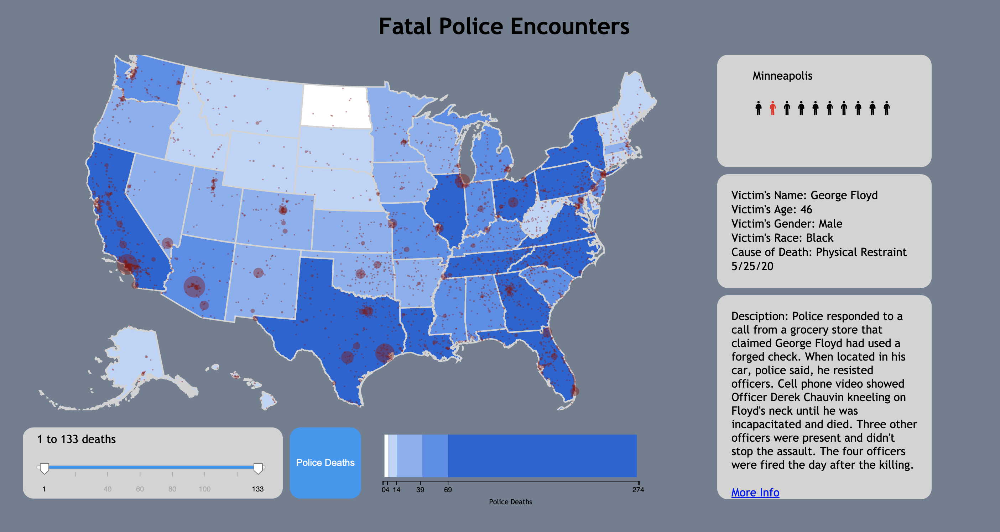

# Police killings data visualization

The past year has been a major wake up call for America in terms of police brutality. With this project the goal was to create a powerful visualization to further expose this crisis and educate others on police violence. We used a database from [mappingpoliceviolence.org](https://mappingpoliceviolence.org/), in which I cleaned the data by mapping locations of deaths given by cities to coordinates (see jupyter notebook files if interested in the data cleaning process). The visualization has the ability to zoom and move around the country. County lines will appear and disappear based on the magnitude of a zoom. The police deaths button reveals a heat map that shows the frequency of police deaths by state. The filter slider allows users to narrow their search, which can be helpful when looking at cities. The vizualization additionally affords the ability to click on a red dot, which then displays a visual of body icons where each body represents a death by a police officer. You can click on the body to learn more about the specific incidence, such as the victim's name, age, race, and a short description of how the death happened. I hope the visualization further sheds major light on the police brutality crisis in America.
